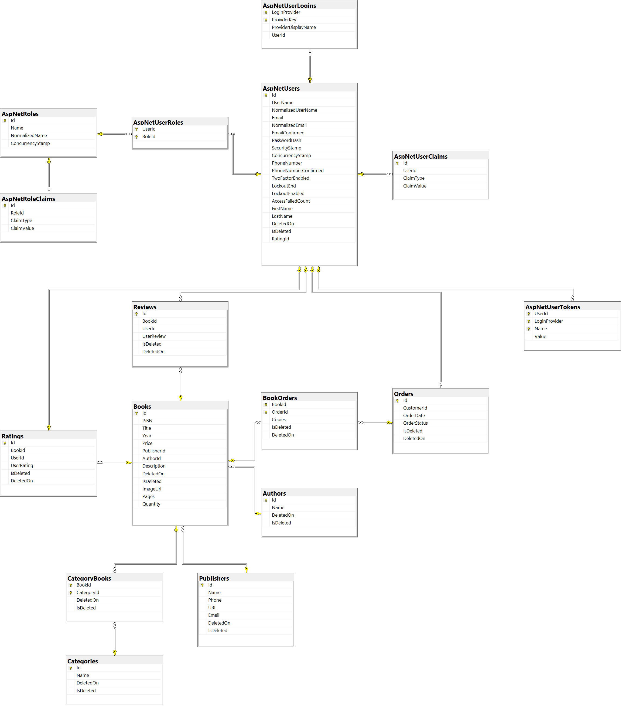

# Book Store

## 📃 Project Description

Book Store is a simple app where users can register, log and view various books. They can rate and review them and in the future maybe even buy them through the app.
It is developed using standard Microsoft MVC template and divided into separate project according to the best practices taught in SoftUni from [Stamo Petkov](https://github.com/stamo).

## 🔨 Built  with [Visual Studio 2022](https://github.com/github/VisualStudio) Using

1. Framework

---------

> [ASP.NET Core 6.0](https://github.com/dotnet/aspnetcore)

---------

2. BackEnd

---------

> [Entity Framework Core 6.0](https://github.com/dotnet/efcore)

> [MSSQL Server](https://www.microsoft.com/en-us/sql-server/sql-server-2019)

> [Docker](https://www.docker.com/)

> [FineCodeCoverage](https://github.com/FortuneN/FineCodeCoverage)

---------

3. Supplementary

---------

> [SendGrid](https://github.com/sendgrid)

> [Newtonsoft.Json](https://github.com/JamesNK/Newtonsoft.Json)

> [HtmlSanitizer](https://github.com/mganss/HtmlSanitizer)

> [Facebook External Login](https://learn.microsoft.com/en-us/aspnet/core/security/authentication/social/facebook-logins?view=aspnetcore-7.0)

> [Repository Pattern - Showed by Nikolai Kostov](https://github.com/NikolayIT/ASP.NET-Core-Template/tree/master/src/Data/AspNetCoreTemplate.Data.Common/Repositories)

---------

4. Testing

---------

> [NUnit](https://github.com/nunit/nunit)

> [Mock](https://github.com/moq/moq)

> [SQLite(InMemory Db for testing)](https://www.sqlite.org/index.html)

---------

5. Additional

---------

> [JavaScript](https://www.javascript.com/)

> [Bootstrap](https://github.com/twbs/bootstrap)

> [Font Awesome](https://fontawesome.com/icons)

## 🌐 Database Diagram

## 👦 Author

* LinkedIn - [Blagovest Napoleonov](https://www.linkedin.com/in/blagovest-napoleonov-84b95223b/)

## 📜 License

This project is licensed with the [MIT license](LICENSE)